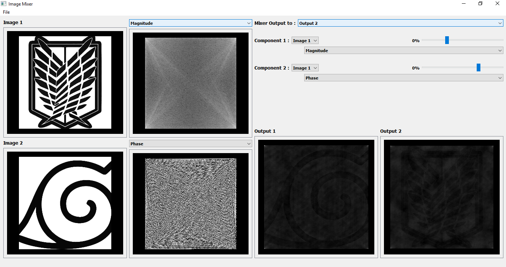
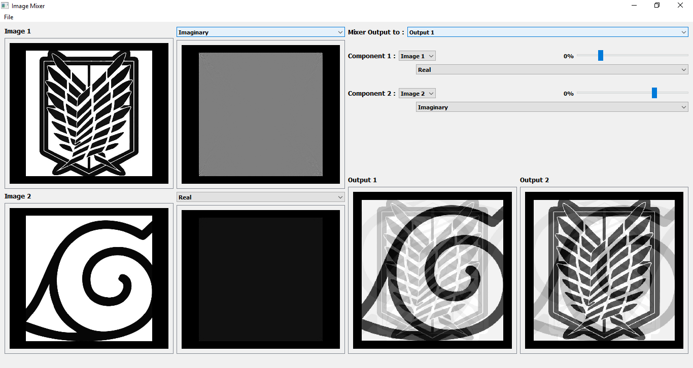

# &emsp;&emsp;&emsp;&emsp;&emsp;&emsp;**`Iamge View & Mixing`**

# **`ABOUT`**

### I have implement a software that make the user import 2 images and the user can see its phasr , magnitude, real and imaginary componant and make mix between them according to any componant of his choice and mix with slider of chose the weight he want from the images.

# **`Output`**
### here is some outputs of the program 
### 1.

### 2.

### For more output and logging file out see out file.

# **`HOW TO USE`**
### you must install all dependences that is not included in your device and just run any file by typing in terminal `python file_name.py.`

